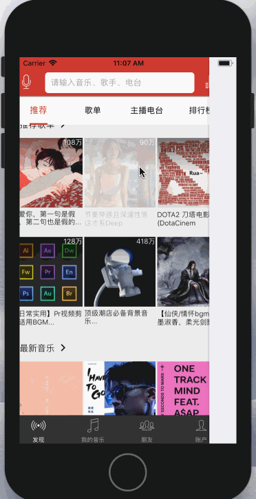
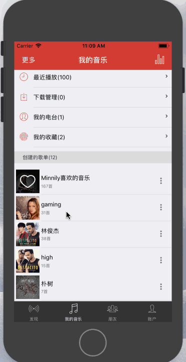
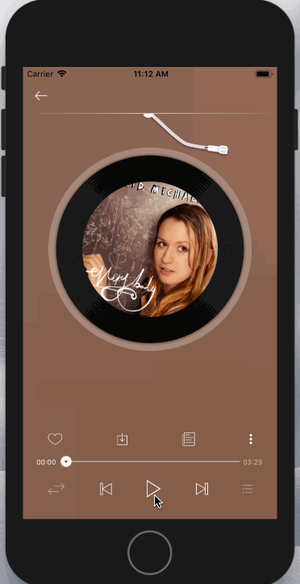
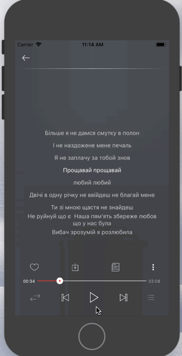

# neteaseRN
* rn仿照网易云音乐的小demo

##  项目简介 
* 只写了播放功能相关的。其他一些展示页面“待某天完善”，网易云音乐功能实在太多
* 项目没做登录状态的判断。所以出现奇怪的现象就退出登录重新登录
* 主要页面展示
    > 
* 登录(登录接口必须为正确输入，否则网易云api直接中断)
    > 
* 一些详情
    > 
* 滚动title
    > 
* 歌曲播放
    > 
* 切换歌，歌词等
    > 
    > 

##  开始之前
* 确认你已经配置好了RN的开发环境
    > [官网写的很详细](https://reactnative.cn/docs/0.51/getting-started.html)
* 项目需要网易云音乐接口。请先行安装并启动接口服务
    > 鸣谢[网易云音乐NodeJs版](https://binaryify.github.io/NeteaseCloudMusicApi/#/)
* 写demo的初衷
    > 看到[yezihaohao项目](https://github.com/yezihaohao/NeteaseCloudMusic)
    突然兴起，然后打算学一下，就写了这个小demo

###  项目使用的核心库和一些第三方库:
* "react": "16.0.0"
* "react-native": "0.51.0"(在写的时候0.52.0和Splash-screen插件冲突。所以用的51版本)
* "react-native-linear-gradient": "^2.4.0"(渐变色)
* "react-native-slider": "^0.11.0"(滑动组件)
* "react-native-splash-screen": "^3.0.6"(过渡页)
* "react-native-storage": "^0.2.2"(类似localStorage的异步永久库)
* "react-native-swiper": "^1.5.13"(轮播组件)
* "react-native-vector-icons": "^4.5.0"(图标字体)
* "react-native-video": "^2.0.0"(播放器)
* "react-navigation": "^1.4.0"(导航组件)
* "react-redux": "^5.0.7"
* "redux": "^3.7.2"
* "redux-thunk": "^2.2.0"(redux管理项目的数据，以及状态)

## 总结
* 总的来说。项目应该没什么难点，就是可能播放那一块的逻辑需要理清楚，并且要较好地管理与播放相关的数据与状态。
* 写网易云音乐作为自己的第一个RNdemo，还是挺不错的，不会显得非常简单。也不是非常困难，一般的问题多想想还是可以解决的。如果有实际项目那就更好了。应该提升的很快
* 当然项目仅供学习交流。不多说了，我去看看小程序怎么玩

    

